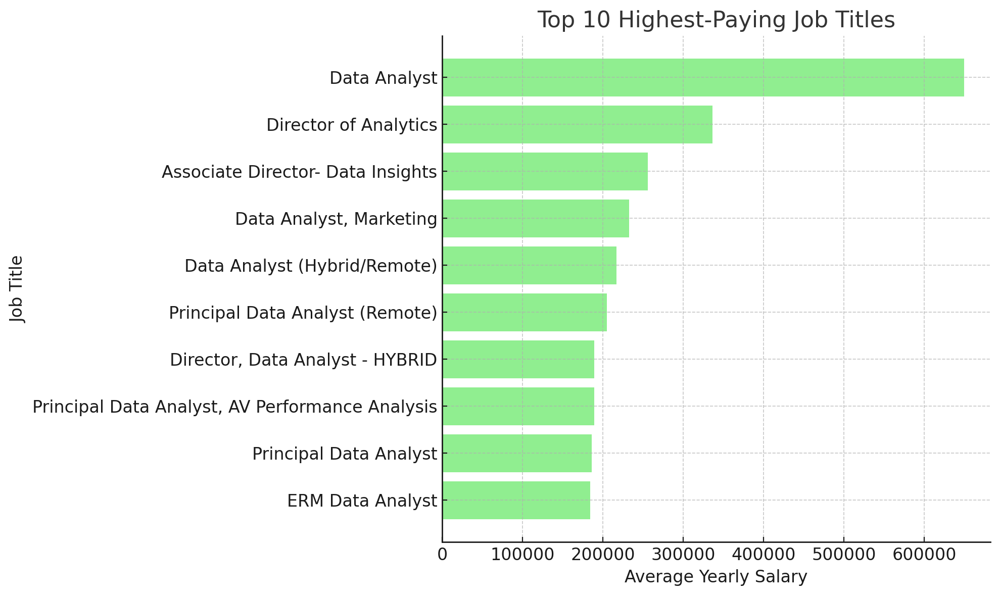
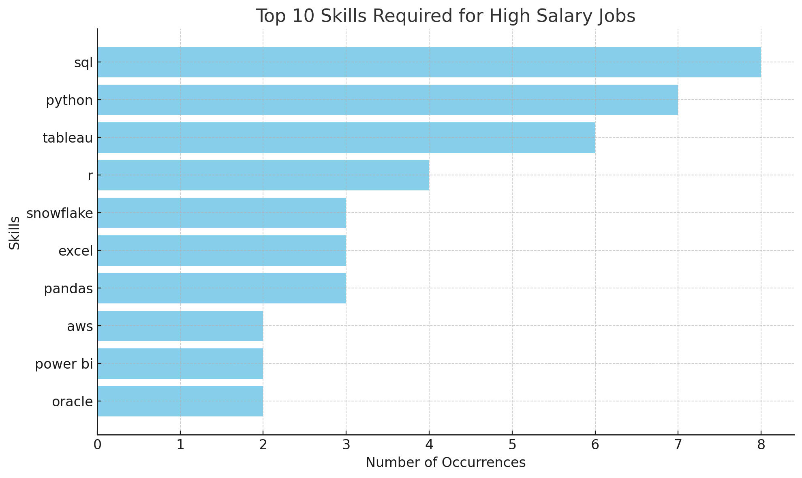

# Introduction
Dive into the data job market! Focusing on data analyst roles. This project explores top-paying jobs, in-demand skills, and where high demand meets high salary in data analytics.
SQL queries? Check them out here: [project_sql folder](/project_sql/)
# Background
Project pinpoints top-paid and in-demand skills. SQL queries answer:
1. What are the top-paying data analyst jobs?
2. What skills are required for these top-paying jobs?
3. What skills are most in demand for data analysts?
4. Which skills are associated with higher salaries?
5. What are the most optomal skills to learn?
# Tools I used
1. **SQL**: Query database and unearth critical insights.
2. **PostgreSQL**: The chosen database management system, ideal for handling job posting data.
3. **Visual Studio Code**: My go-to database management and executing SQL queries
4. **GIT & GitHub**: Essential for version control and sharing my SQL scripts and analysis, ensuring collaboration and project tracking.
# The Analysis
Each query for this project aimed at investigating specific aspects of the data analyst job market. Here's how I approached each question:
### 1. Top Payinh Data Analyst Jobs
To identify the highest-paying roles I filtered data analyst positions by average yearly salary and location, focusing on remote jobs.
```sql
SELECT
    job_id,
    job_title,
    job_location,
    job_schedule_type,
    salary_year_avg,
    job_posted_date,
    name AS company_name
FROM 
    job_postings_fact
LEFT JOIN company_dim ON job_postings_fact.company_id = company_dim.company_id
WHERE
    job_title_short = 'Data Analyst' AND
    job_location = 'Anywhere' AND 
    salary_year_avg IS NOT NULL
ORDER BY 
    salary_year_avg DESC
LIMIT 10;
```
Here's the breakdown of the top data analyst jobs in 2023:
- **Wide Salary Range:** Top 10 paying data analyst rolesspan from $184,000 to 650,000, indicating significant salary potential in the field
- **Diverse Employers:** Companies like SmartAsset, Meta, and AT&T are among those offering high salaries, showing a broad interest accross different indistries.
- **Job Title Variety:** There's a high diversity in job titles, from Data Analyst to Director of Analytics, reflecting varied roles and specializations within data analytics.


*Bar graph visualizing the salary for the top 10 salaries for data analytics;Grapg was generated by ChatGPT from SQL query results

### 2. Skills for Top Paying Jobs
To understand what skills are required for the top paying jobs, I joined the job postings with the skill data

```sql
WITH top_paying_jobs AS (
    SELECT
        job_id,
        job_title,
        salary_year_avg,
        name AS company_name
    FROM 
        job_postings_fact
    LEFT JOIN company_dim ON job_postings_fact.company_id = company_dim.company_id
    WHERE
        job_title_short = 'Data Analyst' AND
        job_location = 'Anywhere' AND 
        salary_year_avg IS NOT NULL
    ORDER BY 
        salary_year_avg DESC
    LIMIT 10
)

SELECT top_paying_jobs.*,
skills
FROM top_paying_jobs
INNER JOIN skills_job_dim ON top_paying_jobs.job_id = skills_job_dim.job_id
INNER JOIN skills_dim ON skills_job_dim.skill_id = skills_dim.skill_id
ORDER BY
     salary_year_avg DESC
```
Here's the breakdown of the most demanded skills for the top 10 highest paying data analyst job in 2023:
- SQL is leading with a bold count of 8.
- Python follows closesly with a bold count of 7
- Tableau is also highly sought after, with a bold count of 6.



### 3. In-Demand Skills for Data Analysts

This query helped identify the skills most frequently requested in job postings, directing focus to areas with high demand.

```sql
SELECT 
    skills,
    COUNT(skills_job_dim.job_id) AS demand_count
FROM job_postings_fact
INNER JOIN skills_job_dim ON job_postings_fact.job_id = skills_job_dim.job_id
INNER JOIN skills_dim ON skills_job_dim.skill_id = skills_dim.skill_id
WHERE
    job_title_short = 'Data Analyst' 
    AND job_work_from_home = True 
GROUP BY
    skills
ORDER BY
    demand_count DESC
LIMIT 5;
```
Here's the breakdown of the most demanded skills for data analysts in 2023

- SQL and Excel remain fundamental, emphasizing the need for strong foundational skills in data processing and spreadsheet manipulation.
-Programming and Visualization Tools like Python, Tableau, and Power BI are essential, pointing towards the increasing importance of technical skills in data storytelling and decision support.

| Skills   | Demand Count |
|----------|--------------|
| SQL      | 7291         |
| Excel    | 4611         |
| Python   | 4330         |
| Tableau  | 3745         |
| Power BI | 2609         |


### 4. Skills Based on Salary
Exploring the average salaries associated with different skills revealed which skills are the highest paying.
```sql
SELECT 
    skills,
    ROUND(AVG(salary_year_avg), 0) AS avg_salary
FROM job_postings_fact
INNER JOIN skills_job_dim ON job_postings_fact.job_id = skills_job_dim.job_id
INNER JOIN skills_dim ON skills_job_dim.skill_id = skills_dim.skill_id
WHERE
    job_title_short = 'Data Analyst'
    AND salary_year_avg IS NOT NULL
    AND job_work_from_home = True 
GROUP BY
    skills
ORDER BY
    avg_salary DESC
LIMIT 25;
```
*Table of the average salary for the top 10 paying skills for data analysts*

| Skills       | Average Salary ($) |
|--------------|--------------------|
| pyspark      | 208,172            |
| bitbucket    | 189,155            |
| couchbase    | 160,515            |
| watson       | 160,515            |
| datarobot    | 155,486            |
| gitlab       | 154,500            |
| swift        | 153,750            |
| jupyter      | 152,777            |
| pandas       | 151,821            |
| elasticsearch| 145,000            |

### 5.  Most Optimal Skills to Learn
Combining insights from demand and salary data, this query aimed to pinpoint skills that are both in high demand and have high salaries, offering a strategic focus for skill development.
```sql
WITH skills_demand AS (
    SELECT 
        skills_dim.skill_id,
        skills,
        COUNT(skills_job_dim.job_id) AS demand_count
    FROM job_postings_fact
    INNER JOIN skills_job_dim ON job_postings_fact.job_id = skills_job_dim.job_id
    INNER JOIN skills_dim ON skills_job_dim.skill_id = skills_dim.skill_id
    WHERE 
        job_title_short = 'Data Analyst' AND
        salary_year_avg IS NOT NULL AND
        job_work_from_home = TRUE
    GROUP BY
        skills_dim.skill_id
), avg_salary AS (
    SELECT 
        skills_dim.skill_id,
        skills,
        ROUND(AVG(salary_year_avg), 0) AS avg_salary
    FROM job_postings_fact
    INNER JOIN skills_job_dim ON job_postings_fact.job_id = skills_job_dim.job_id
    INNER JOIN skills_dim ON skills_job_dim.skill_id = skills_dim.skill_id
    WHERE 
        job_title_short = 'Data Analyst' AND
        salary_year_avg IS NOT NULL AND
        job_work_from_home = TRUE
    GROUP BY
        skills_dim.skill_id
)
SELECT 
    skills_demand.skill_id,
    skills_demand.skills,
    demand_count,
    avg_salary
FROM
    skills_demand
INNER JOIN avg_salary ON skills_demand.skill_id = avg_salary.skill_id
WHERE
    demand_count > 10
ORDER BY
    demand_count DESC,
    avg_salary DESC
LIMIT 25;
```
*Table of the most optimal skills for data analyst sorted by salary*

| Skill ID | Skills     | Demand Count | Average Salary ($) |
|----------|------------|--------------|--------------------|
| 8        | go         | 27           | 115,320            |
| 234      | confluence | 11           | 114,210            |
| 97       | hadoop     | 22           | 113,193            |
| 80       | snowflake  | 37           | 112,948            |
| 74       | azure      | 34           | 111,225            |
| 77       | bigquery   | 13           | 109,654            |
| 76       | aws        | 32           | 108,317            |
| 4        | java       | 17           | 106,906            |
| 194      | ssis       | 12           | 106,683            |
| 233      | jira       | 20           | 104,918            |


# Conclusion

From the analysis, several general insights emerged:

- Top-Paying Data Analyst Jobs: The highest-paying jobs for data analysts that allow remote work offer a wide range of salaries, the highest at $650,000.
- Skills for Top-Paying Jobs: High-paying data analyst jobs require advanced proficiency in SQL.
- Most In-Demand Skills: SQL is also the most demanded skill in the data analyst job market.
- Skills with Higher Salaries: Specialized skills, such as SVN and Solidity, are associated with the highest average salaries.
- Optimal Skills for Job Market Value: SQL leads in demand and offers for a high average salary.